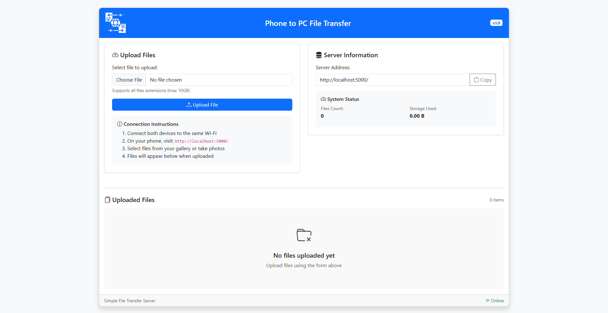
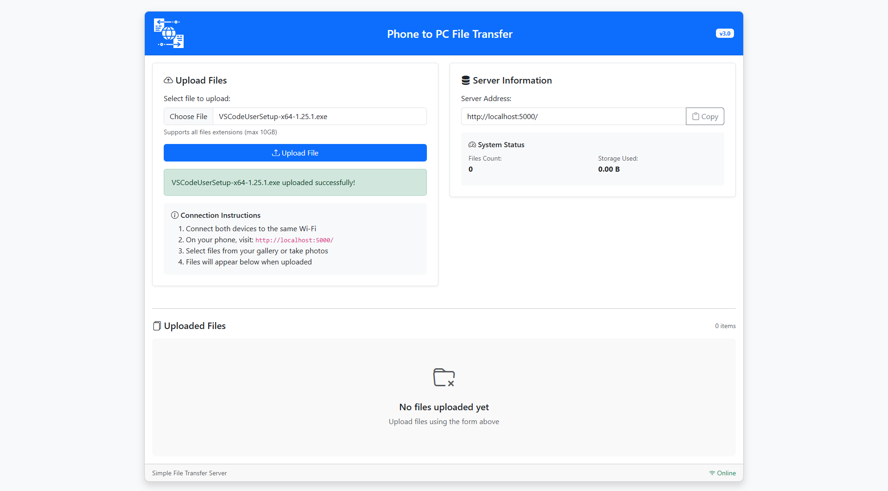

# File Transfer Web Application


A simple and secure web application for file transfer built with Flask. This application allows users to upload and download files through a clean web interface.

## Features

- 🚀 Easy file upload and download
- 💻 Clean and responsive web interface
- 🔒 Secure file handling
- 🐳 Docker support for easy deployment

## Screenshots

### Home Page


### Upload Process


## Prerequisites

- Python 3.x
- Docker (optional)

## Installation

### Local Setup

1. Clone the repository:
   ```bash
   git clone https://github.com/yourusername/file-transfer.git
   cd file-transfer
   ```

2. Install dependencies:
   ```bash
   pip install -r requirements.txt
   ```

3. Run the application:
   ```bash
   python app/app.py
   ```

### Docker Setup

1. Build the Docker image:
   ```bash
   docker build -t file-transfer .
   ```

2. Run the container:
   ```bash
   docker run -p 5000:5000 file-transfer
   ```

The application will be available at `http://localhost:5000`

## Usage

1. Open your web browser and navigate to `http://localhost:5000`
2. Click on the "Choose File" button to select a file
3. Click "Upload" to transfer the file
4. The file will be stored in the uploads directory

## Project Structure

```
├── Dockerfile
├── app
│   ├── app.py
│   ├── static
│   │   └── style.css
│   ├── templates
│   │   └── index.html
│   └── uploads
└── requirements.txt
```

## Contributing

1. Fork the repository
2. Create your feature branch (`git checkout -b feature/AmazingFeature`)
3. Commit your changes (`git commit -m 'Add some AmazingFeature'`)
4. Push to the branch (`git push origin feature/AmazingFeature`)
5. Open a Pull Request

## License

This project is licensed under the MIT License - see the [LICENSE](LICENSE) file for details.

## Acknowledgments

- Flask framework
- Docker
- Bootstrap for styling